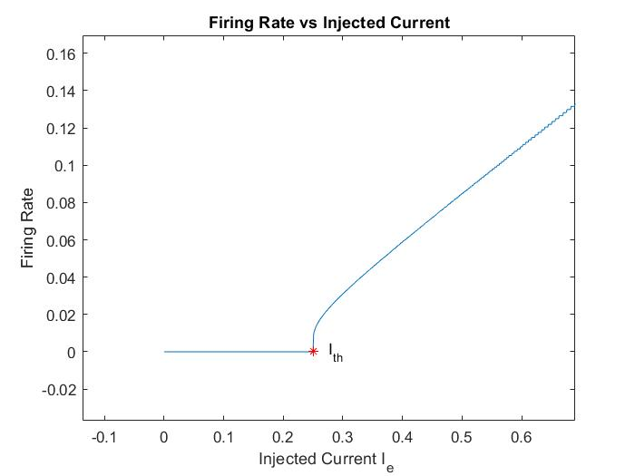

LIFmy.m is my code for Leaky Integrate and Fire Model (Problem 2) 

To call it use
```
 [V,I,t,spikeTimes] = LIFmy(amp) 
%where amp is the current you want to inject in nA,
```
this is the same syntax like the question 

&gt; 0.25 nA has to be injected for spiking to occur

Plot graphs as 
```
plot(t,V)
plot(t,I)
```
Solutions in the pdf file besides the questions 

Code to plot Firing Rate vs I_e graph was deleted by me before saving hence skipped. The plot is available as the frvsie(.jpg, .fig) file. 



