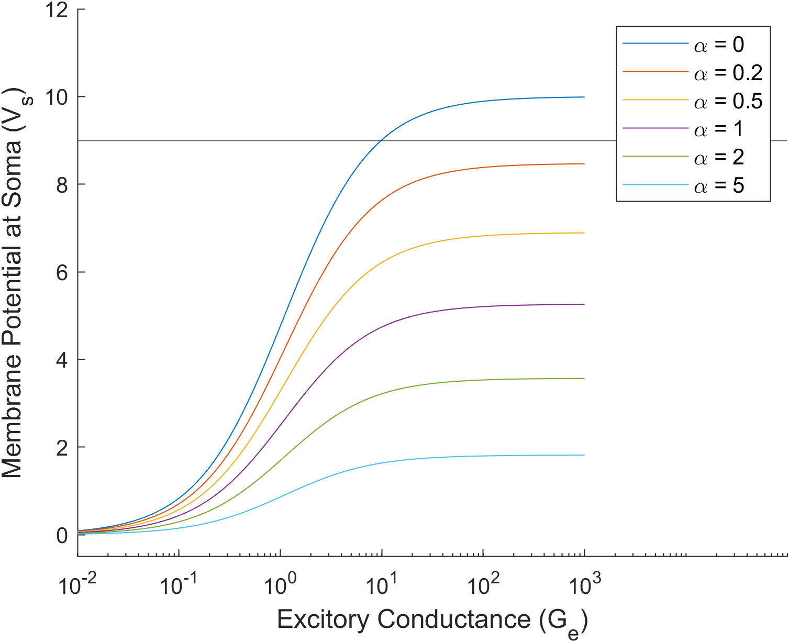
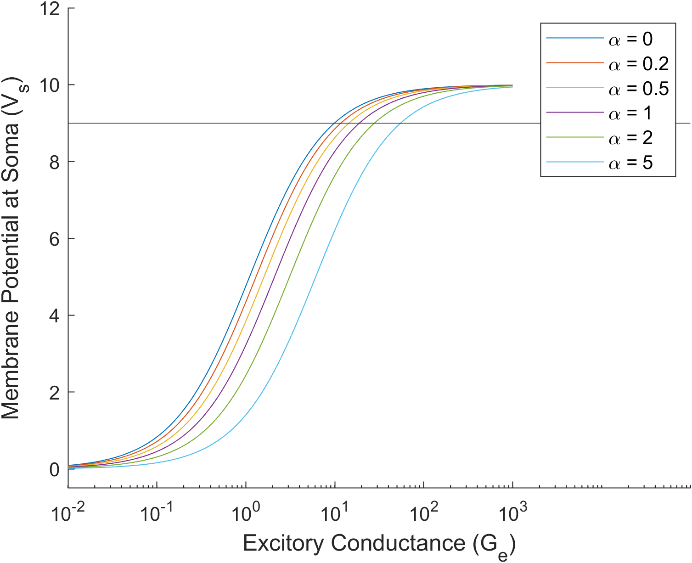

Simulating the two compartment models of dendritic and somatic inhibition from "Evidence for a Computational Distinction Between Proximal and Distal Neuronal Inhibition (Vu and Krasne, 1992)" https://www.science.org/doi/abs/10.1126/science.1553559

PDF file has my analytical solutions

Somatic inhibition:

Dendritic inhibition:

