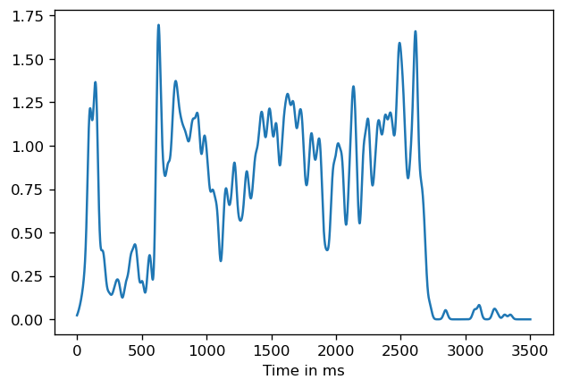
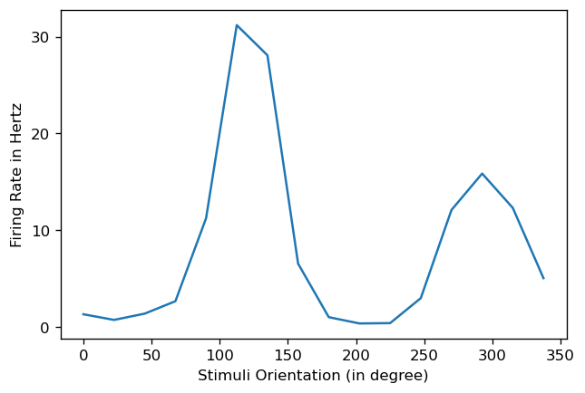

Solutions in PDF

## 4a Tuning Curves for neuron in visual cortex

**Problem1_PTSH_SDF.ipynb** has the code I had written for the exercises 

six.mat is the file with just data from orientation 6 \
Plots displayed below \
The frequency (ie. Y axis) labels may be incorrect for a few graphs as I was not able to resolve the issue. Happy to receive feedback for it !

### Raster Plot for Orientation 6

### Peri-stimulus time histogram (PSTH) for Orientation 6

### Convolution of Spike Train with Box Car Kernel for Orientation 6

### Convolution of Spike Train with Gaussian for Orientation 6

###Spike Density Function for Orientation 6

### Tuning Curve for neuron

### Adjusted Tuning Curve for neuron with no-stimulus firing rate removed

