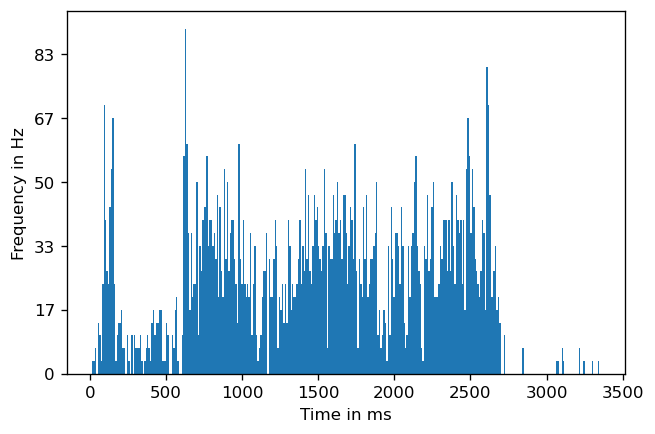
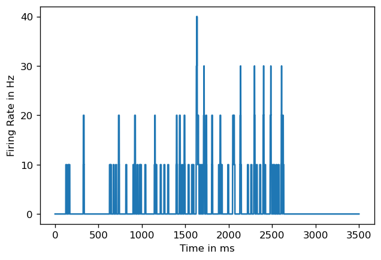
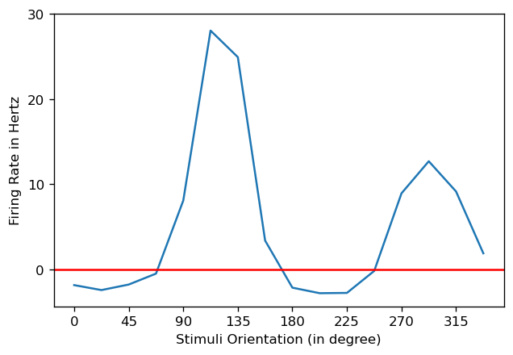

Solutions in PDF

**Problem1_PTSH_SDF.ipynb** has my code for the Problem 1 (Tuning Curves)

**mycode.m** has my code for Problem 2 (STRF and Spike Triggered Averaging). There is a deliberate repetion of code in plots so run whatever plot you want to generate. Run generateStimulus.m and generateKernel.m before running mycode.m

Plots displayed below. Search 4b to jump to plots of Spike Triggered Averaging problem 

## 4a Tuning Curves for neuron in visual cortex

six.mat is the file with just data from orientation 6 \
The frequency (ie. Y axis) labels may be incorrect for a few graphs as I was not able to resolve the issue. Happy to receive feedback for it !

### Raster Plot for Orientation 6

### Peri-stimulus time histogram (PSTH) for Orientation 6

### Convolution of Spike Train with Box Car Kernel for Orientation 6

### Convolution of Spike Train with Gaussian for Orientation 6

### Spike Density Function for Orientation 6

### Tuning Curve for neuron

### Adjusted Tuning Curve for neuron with no-stimulus firing rate removed

## 4b Spike Triggered Averaging to estimate auditory Spatio-temporal Receptive field

### Kernel (This code is provided by MIT)

### Stimuli, Excitatory Drive to neuron, Spiking

### Spike Triggered Average (150 ms before Spike)

### Spike Triggered Average (at Spike)

The kernel had 0 contribution in the middle frequencies but the STA has still counted them
during calculation. Although the STA plot shows low activity in these frequencies, a better
representative would be if random activity still occurred in these frequencies yet there was
a definite pattern of spiking. At the spikes, the STA shows high activity towrds the higher
frequency and low activity in the lower frequency. But the kernel had both positive and
negative contributions in the top and bottom in equal values. So STA would suggest that
top has mainly positive contribution and bottom has mainly negative contribution which is
not what the Kernel is.

### Spike Triggered Average (100 ms before Spike as kernel is 100 ms long)

### Spike Triggered Average (150 ms - 100 ms before Spike) 
To see issues caused by difference in STA width and kernel width

