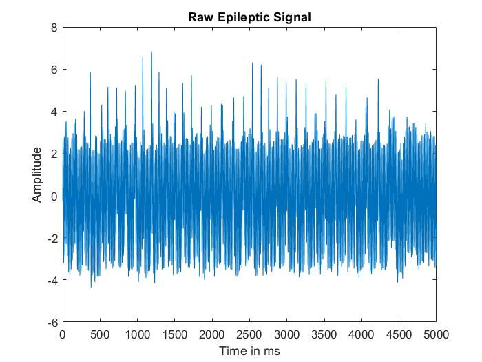
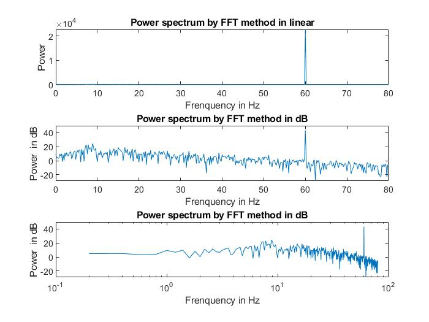
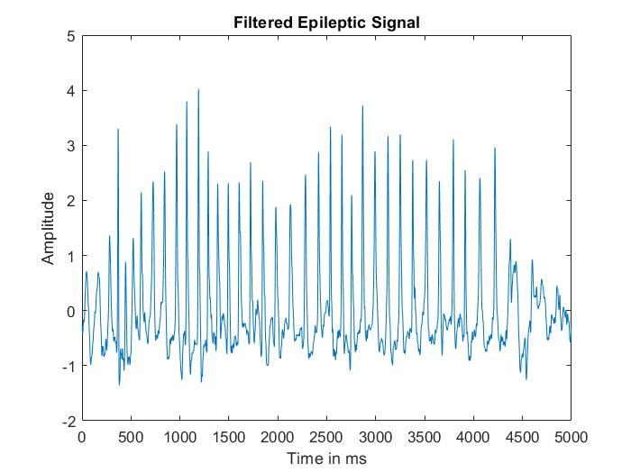
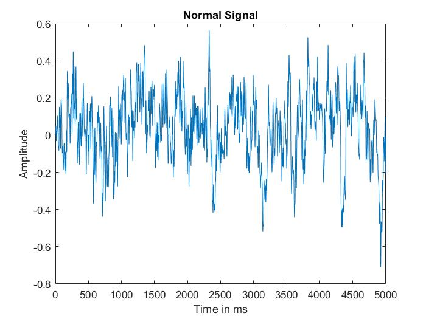
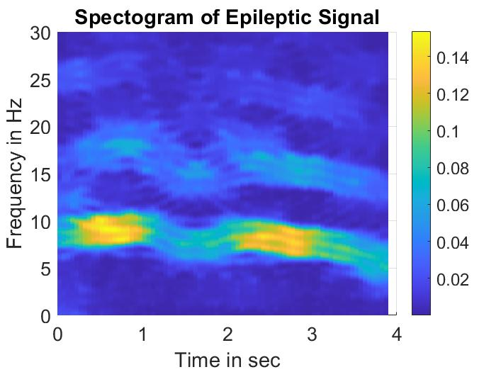
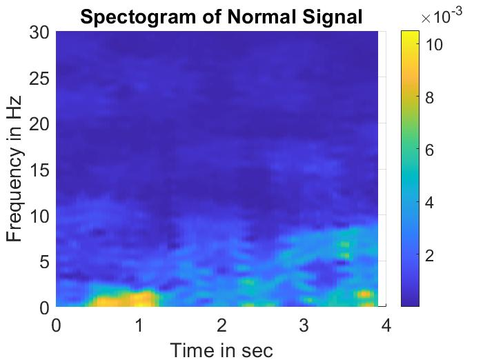

Solutions in PDF

**mycode.m** has my code for all the analysis. There is a deliberate repetion of code in plots so run whatever plot you want to generate.

Selected plots displayed below

## Epileptic Vs Normal PFC signals

Epileptic had 60 Hz contamination. Normal did not have any contamination.

### Power Spectrum Of Epileptic Signal

