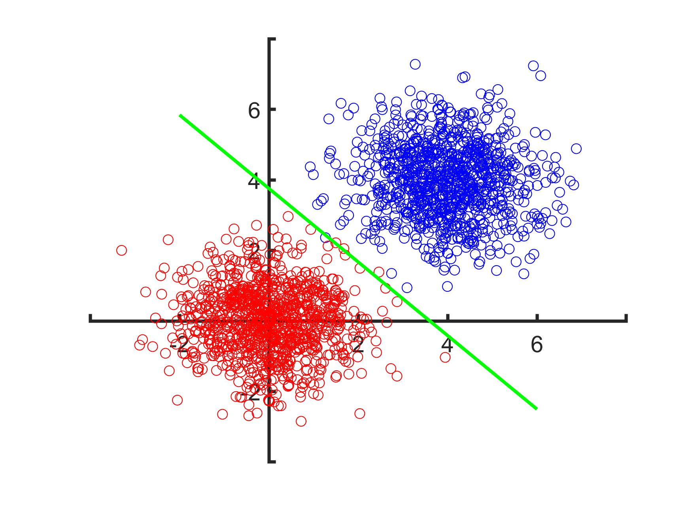
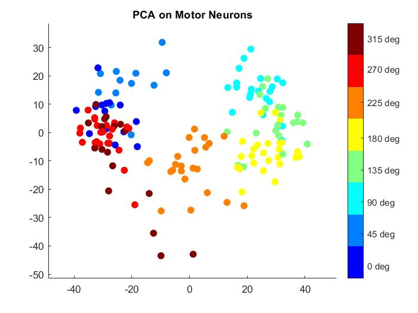
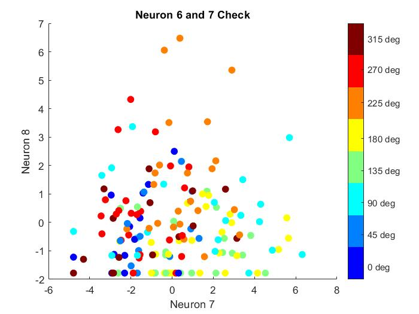

Solutions in PDF

**mycode.m** has my code for analysis of Motor Cortex data. 

Selected plots displayed below

## Perceptron Classification

Green Line is the decision boundary found by my code

### Motor Cortex PCA 

### Neuron 6 and 7 mean-subtracted data 

Used to debug code - whether it matches the provided plot or not

