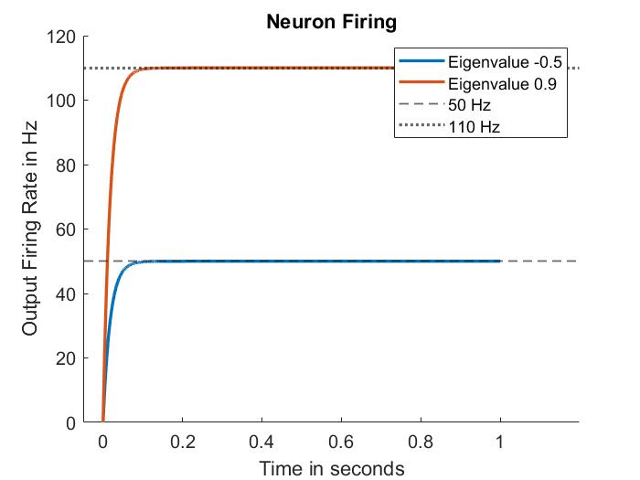
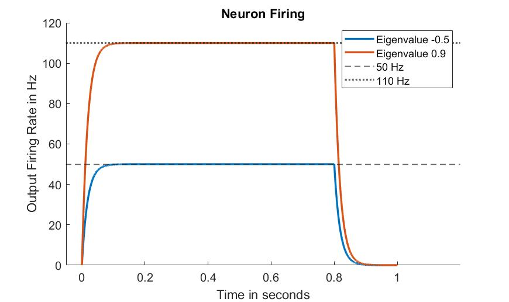
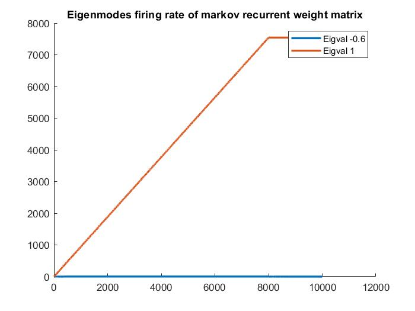

Solutions in **mysolution.pdf** 

I am very uncertain of the correctness of my work in Part 3. Please reach out if you have an idea about what's correct!

**mycode.m** has my code for all the simulations. 
Selected plots displayed below

## Neuron Firing Rate from given Weights

eigenvalue corresponds to the eigenmode which was then transformed back to individual neuron and plotted

## Neuron Firing Rate from given Weights with input only 0.8s

Same as above but input lasts 0.8s and not 1s

## Eigenmode Rates from markov matrix I constructed with input for 0.8s

I do not know about the correctness of this so beware. 

